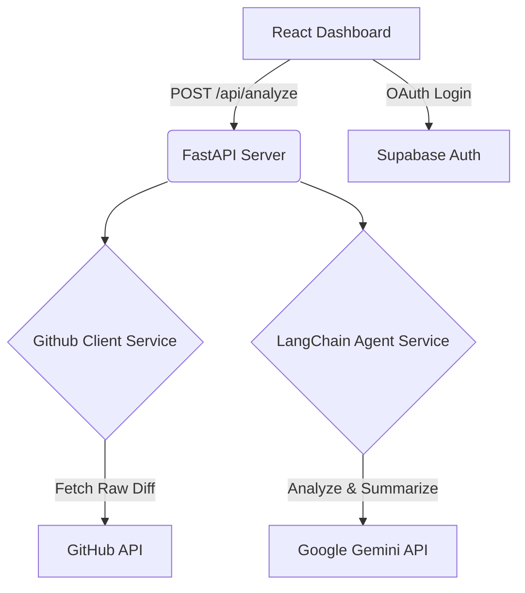

# NEXUS Review


Nexus Review is an enterprise-grade automated code review platform. Simply paste a GitHub Pull Request URL, and our LangChain-powered agent analyzes the raw diff to detect critical vulnerabilities, stylistic inconsistencies, and logic bugs instantly.

## ✨ Features
- **Autonomous Analysis**: Catches OWASP Top 10 risks, performance bottlenecks, and logic flaws in seconds.
- **Supabase Authentication**: Secure, JWT-based user authentication using Google OAuth.
- **Premium UI/UX**: High-performance React frontend featuring glassmorphism, dynamic cursor-tracking radial gradients, and fluid CSS animations.
- **Microservice Architecture**: Clean separation between the React frontend and the FastAPI/LangChain backend.

## 🏗 System Architecture



## 🚀 Directory Structure
```
Nexus-Review/
├── backend/                  # Production-ready FastAPI Application
│   ├── api/routes.py         # REST Endpoints
│   ├── schemas/pr.py         # Pydantic Validation Models
│   ├── services/agent.py     # LLM Langchain Logic
│   └── main.py               # Uvicorn Entrypoint
├── frontend/                 # Vite + React Dashboard
│   ├── src/components/       # Modular UI Components (Mantine)
│   ├── src/contexts/         # React Context Providers (AuthContext)
│   ├── src/pages/            # Next-gen UI Pages (Dashboard, AuthPage)
│   ├── src/services/         # API & Supabase Integration Layer
│   └── src/styles/           # Global CSS and Modular Stylesheets
├── .env                      # Single Source of Truth for all Environment Variables
```

## 🛠 Setup & Installation

### 1. Environment Configuration
Create a single `.env` file in the **root** directory. Both the backend and frontend are configured to read from this file:
```env
# Backend Keys
GITHUB_TOKEN=your_personal_access_token
GOOGLE_API_KEY=your_gemini_api_key

# Frontend Supabase Keys (Must start with VITE_)
VITE_SUPABASE_URL=your_supabase_project_url
VITE_SUPABASE_ANON_KEY=your_supabase_anon_key
```

### 2. Backend Setup
Navigate to the root directory and activate your virtual environment:
```bash
source venv/bin/activate
pip install -r requirements.txt
```

Run the backend server from the `backend/` module:
```bash
uvicorn backend.main:app --reload --port 8000
```

### 3. Frontend Setup
Navigate to the `frontend/` directory and install dependencies:
```bash
cd frontend
npm install
npm run dev
```

The application will be accessible at `http://localhost:5173`. You will be greeted by the stunning Auth Page.